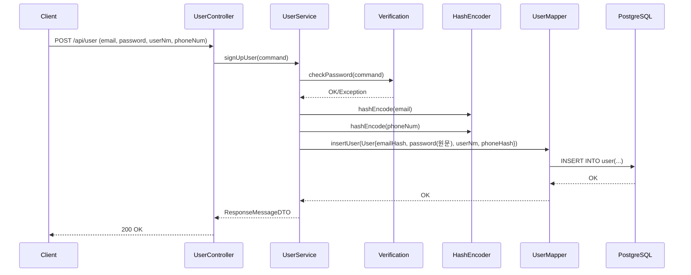
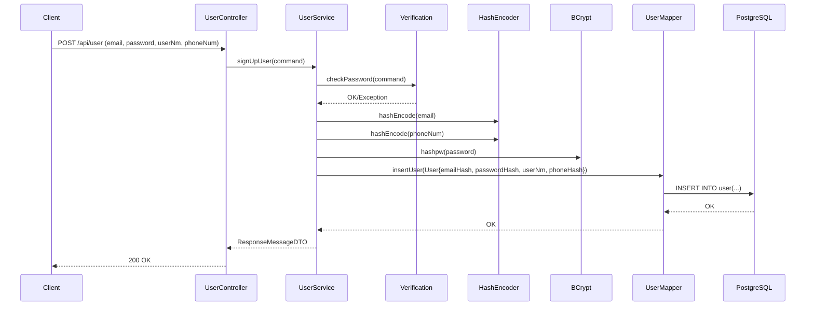

# 변경 내용 요약

- HashEncoder를 고정 키 기반 HMAC-SHA256 방식으로 변경했습니다.
- 회원가입 시 이메일/전화번호 해시 생성 로직을 새 방식으로 통일했습니다.
- 해시 비밀키 설정을 application-local.yml에 추가했습니다.

## 변경 파일

- src/main/java/com/crud/study/domain/HashEncoder.java
  - HMAC-SHA256 구현으로 교체
  - 동일 입력 -> 동일 해시 결과

- src/main/java/com/crud/study/application/UserService.java
  - getSalt/getEncrypt 호출 제거
  - hashEncode 호출로 이메일/전화번호 해시 생성

- src/main/resources/application-local.yml
  - app.hash.secret 추가

## 주의 사항

- app.hash.secret 값은 반드시 안전한 값으로 변경해야 합니다.
- 기존 데이터는 이전 방식의 해시값이므로 재해시 또는 초기화가 필요합니다.

## 회원가입 시 비밀번호 처리 흐름(현재 기준)

현재 코드 기준으로는 **비밀번호 암호화/해시 처리가 없습니다**. 즉, 입력한 비밀번호가 그대로 DB에 저장됩니다.  
아래는 현재 흐름을 순서대로 정리한 내용입니다.

1) 클라이언트가 회원가입 API(`/api/user`)로 이메일/비밀번호/이름/전화번호를 전송  
2) `UserController`가 요청을 `UserService.signUpUser()`에 전달  
3) `Verification.checkPassword()`에서 비밀번호/재입력 비밀번호 일치 여부만 검증  
4) 이메일/전화번호는 `HashEncoder.hashEncode()`로 HMAC 해시 처리  
5) 비밀번호는 변환 없이 그대로 `User` 객체에 담김  
6) `UserMapper.insertUser()`가 DB에 저장

### 시퀀스 다이어그램(현재 기준)

## 회원가입 시 비밀번호 처리 흐름(개선안: BCrypt 적용)

아래는 비밀번호를 BCrypt로 해시 저장하도록 개선했을 때의 흐름입니다.

1) 클라이언트가 회원가입 API(`/api/user`)로 이메일/비밀번호/이름/전화번호를 전송  
2) `UserController`가 요청을 `UserService.signUpUser()`에 전달  
3) `Verification.checkPassword()`에서 비밀번호/재입력 비밀번호 일치 여부만 검증  
4) 이메일/전화번호는 `HashEncoder.hashEncode()`로 HMAC 해시 처리  
5) 비밀번호는 `BCrypt.hashpw()`로 해시 생성 후 저장  
6) `UserMapper.insertUser()`가 DB에 저장

### 시퀀스 다이어그램(BCrypt 적용)

